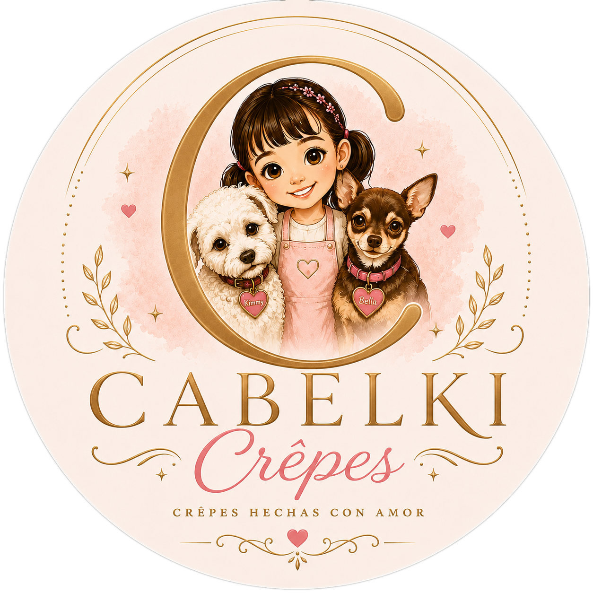
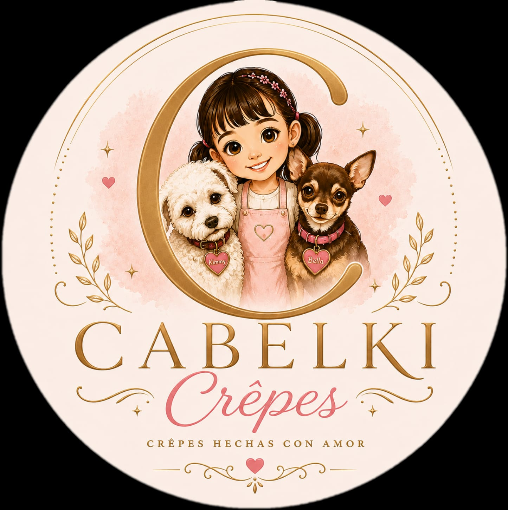

# CABELKI Crêpes — Change Log

> All UX/UI improvements applied locally based on the full site analysis.  
> Local preview: `http://localhost:8080`  
> Repo: `https://github.com/mgalicias/cabelki`

---

## [v1.1.0] — 2026-09-01

### 🔴 Critical Bug Fixes

- [x] **FIX-1** — Hero image: `hero-crepe.png` (1.9 MB) → `hero-crepe.jpeg` (187 KB)
  _File_: `index.html` · Line 84
  ```diff
  - 
  + 
  ```

- [x] **FIX-2** — `og:image` now uses absolute URL for proper social sharing
  _File_: `index.html` · Line 16
  ```diff
  - <meta property="og:image" content="assets/logo/favicon.svg">
  + <meta property="og:image" content="https://cabelkicrepe.com/assets/logo/favicon.svg">
  ```

- [x] **FIX-3** — Heading hierarchy: standalone toppings section promoted from `<h3>` to `<h2>` and given an `id`
  _File_: `index.html` · Line 345
  ```diff
  - <section class="menu-section menu-section--alt">
  -   <h3 class="section-title">Toppings</h3>
  + <section class="menu-section menu-section--alt" id="toppings-extras">
  +   <h2 class="section-title">Toppings</h2>
  ```

- [x] **FIX-4** — `decoding="async"` added to all 13 `` elements for faster paint
  _File_: `index.html` · All card and feature images

---

### 🟡 UX Improvements

- ~~[x] **UX-1** — Per-card WhatsApp "Ordenar por WhatsApp" CTA on every product card~~ ⛔ **Reverted 2026-09-03**

- [x] **UX-2** — `MXN` currency label added to all price displays (cards, drinks, combos)
  _Files_: `index.html`, `styles.css`
  ```diff
  - <p class="card-price">$114</p>
  + <p class="card-price">$114 <span class="price-currency">MXN</span></p>
  ```
  ```css
  .price-currency { font-size: 0.6em; color: var(--muted-text); }
  ```

- [x] **UX-3** — "Contacto" section rebuilt as a rich info panel
  _Files_: `index.html`, `styles.css`
  - Replaced flat CTA banner with `contact-section` containing:
    - Top CTA block (Ordenar / Instagram / Facebook buttons)
    - 3-column frosted-glass info grid: **Ubicación**, **Horario**, **WhatsApp**
    - Each card has SVG icon, label, value, and deep-link
  - Responsive: 3-col → 2-col (tablet) → 1-col (mobile)

- [x] **UX-4** — Cabelki Velvet drink card highlighted as specialty
  _Files_: `index.html`, `styles.css`
  ```diff
  - <article class="drink-card reveal">
  + <article class="drink-card drink-card--specialty reveal">
  ```
  ```css
  .drink-card--specialty {
    background: linear-gradient(160deg, var(--rose-light), var(--surface));
    border: 1.5px solid var(--rose);
    box-shadow: 0 8px 28px rgba(232, 166, 184, 0.3);
  }
  ```

---

### 🎨 Design Polish

- [x] **DES-1** — `font-display=swap` ensured in Google Fonts URL (prevents FOIT on slow connections)
  _File_: `index.html` · Line 23

- [x] **DES-2** — Card hover now includes a subtle `rotate(0.4deg)` tilt for premium feel
  _File_: `styles.css`
  ```diff
  - transform: translateY(-6px);
  + transform: translateY(-6px) rotate(0.4deg);
  ```

- [x] **DES-3** — Combo cards: emoji icons added per combo for visual identity
  _File_: `index.html`
  ```diff
  + <span class="combo-icon" aria-hidden="true">🥞</span>  <!-- Combo Cabelki -->
  + <span class="combo-icon" aria-hidden="true">⭐</span>  <!-- Combo Signature -->
  + <span class="combo-icon" aria-hidden="true">🤝</span>  <!-- Combo Compartir Cabelki -->
  + <span class="combo-icon" aria-hidden="true">✨</span>  <!-- Combo Compartir Signature -->
  ```

---

## 📋 Pending / Future Work

| ID | Feature | Priority |
|---|---|---|
| FEAT-A | Interactive Order Builder (custom crêpe + WA message generator) | 🔥 High |
| FEAT-B | Instagram feed embed grid | Medium |
| FEAT-C | Testimonials / reviews carousel | Medium |
| FEAT-D | Promotions / Daily Special dismissable banner | Medium |
| FEAT-E | Dark mode toggle | Low |
| FEAT-F | PWA / Add to Home Screen + offline menu | Low |
| PERF-1 | Convert `crepe-al-gusto.png` (2.7 MB) and `fresas-con-crema.png` (2.1 MB) to WebP | 🔥 High |

---

## 📁 Files Modified

| File | Changes Applied |
|---|---|
| `index.html` | FIX-1, FIX-2, FIX-3, FIX-4, ~~UX-1~~, UX-2, UX-3, UX-4, DES-1, DES-3 |
| `styles.css` | ~~UX-1~~, UX-2, UX-3, UX-4, DES-2, DES-3 + responsive breakpoints |
| `CHANGES.md` | This file — created and maintained |

---

## [v1.1.1] — 2026-09-03

### ⛔ Reverted

- **UX-1** — Removed "Ordenar por WhatsApp" button from all 8 product cards per request
  _Files_: `index.html`, `styles.css`
  ```diff
  - <a href="https://wa.me/..." class="btn-order">Ordenar por WhatsApp</a>
  ```
  ```diff
  - /* Per-card WhatsApp order button */
  - .btn-order { ... }
  - .btn-order::before { ... }
  - .btn-order:hover { ... }
  ```

